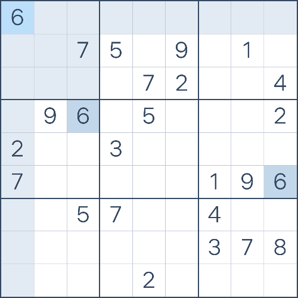

# Sudoku.com Solver
This programs solves the sudokus of sudoku.com until the hard mode, the more difficults ones can't solve them.

# How it works

## Get the sudoku board in form of a 9x9 matrix.
1. The first step, is to get an image of the board.

2. Then we crop all the squares.

3. Then we cropped another time so there are no lines on the image and only the number. And also I passed them to black and white.

4. The last step is to convert it into an array, and add the array into another array with all the squares in array.

## Predict numbers and create the sudoku matrix.
1. The model that I used to predict numbers is inspired in this code . The dataset used for the training is made up of 1090 columns, the first 1089 are the pixels of the image to train and the last column is the number of the image. There are 1089 pixels because after processing the image it remains a 33x33(1089) image. For the dataset I used 10 images of each number.
2. The next step is to predict the numbers and create the sudoku matrix

## Solve the matrix and pass the solution to sudoku.com
1. To solve the matrix, I created a program that iterates for each item and makes a list of the numbers on his x and y axis, and of his square. Then finds which numbers are missing and if there is only missing one it write it on the matrix.
2. And with the solution it goes clicking right click and the number in sudoku.com.

# To do 
- Improve the way that the program click the solution on sudoku.com, because is a bit slow.
- Improve the sudoku solver so it can solves also the difficult modes.
- Find bugs or issues on the code.